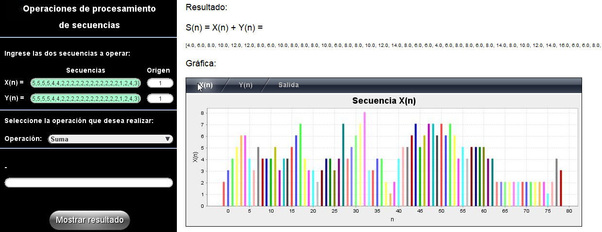
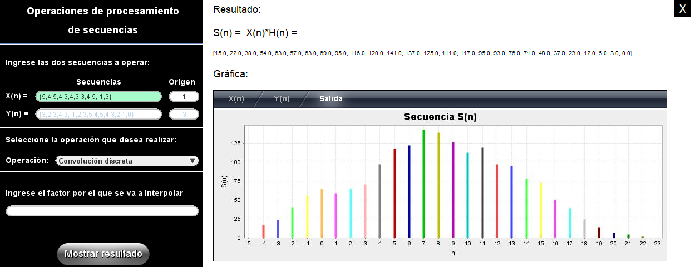
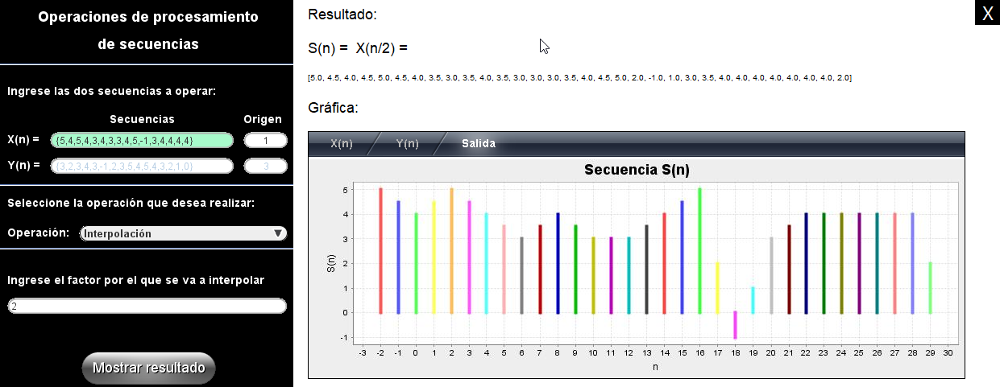
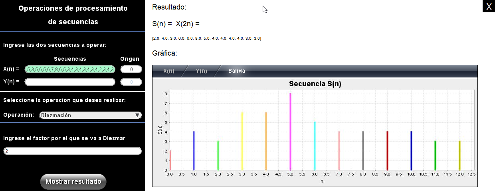
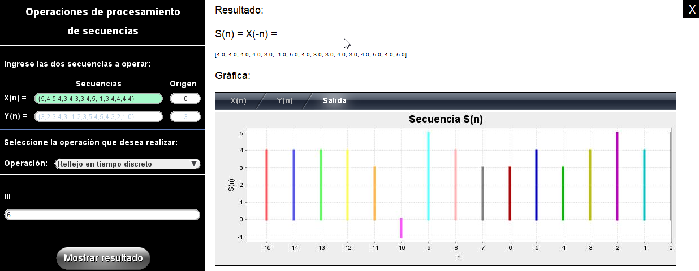
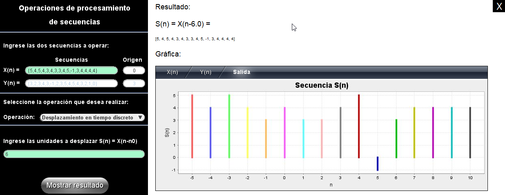
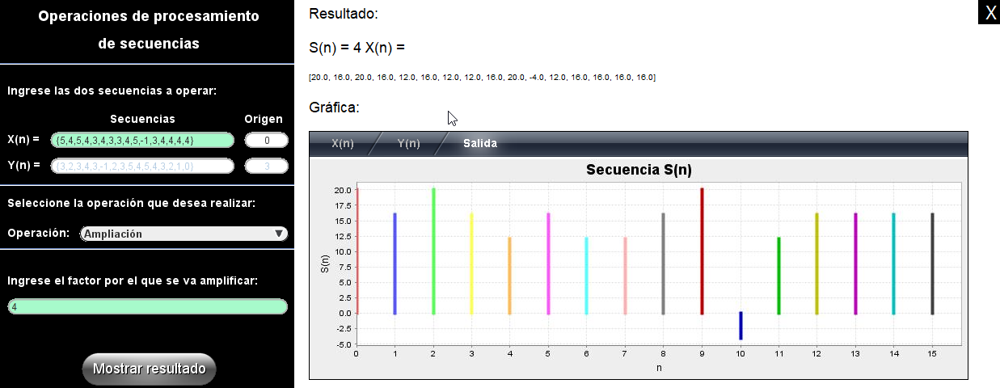
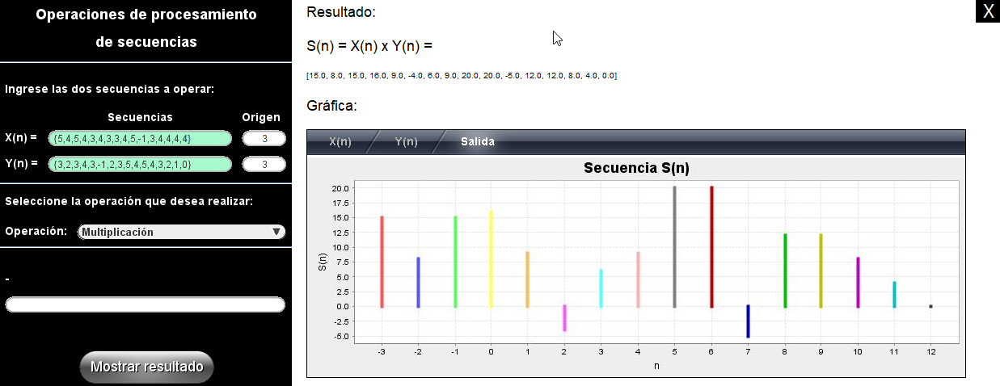
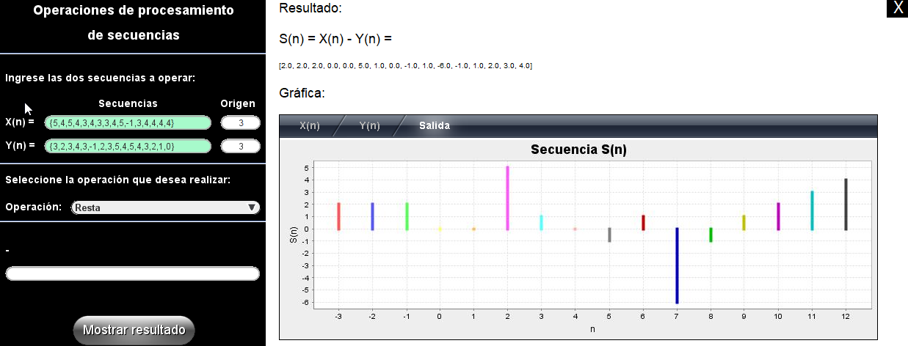
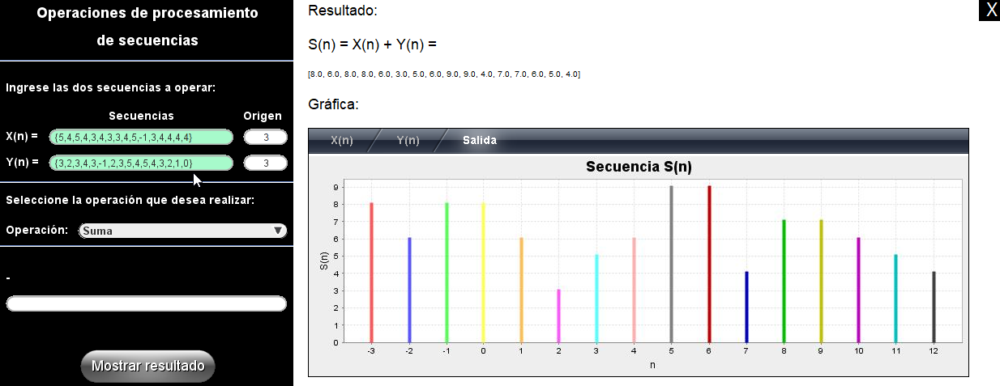

## General View

 

## Discrete Convolution

 

## Interpolation

 

## Decimation

 

## Discrete Time Reflection

 

## Time shifting

 

## Attenuation

 

## Signal Expansion

 

## Multiplication

 

## Substraction

 

## Sum

 

